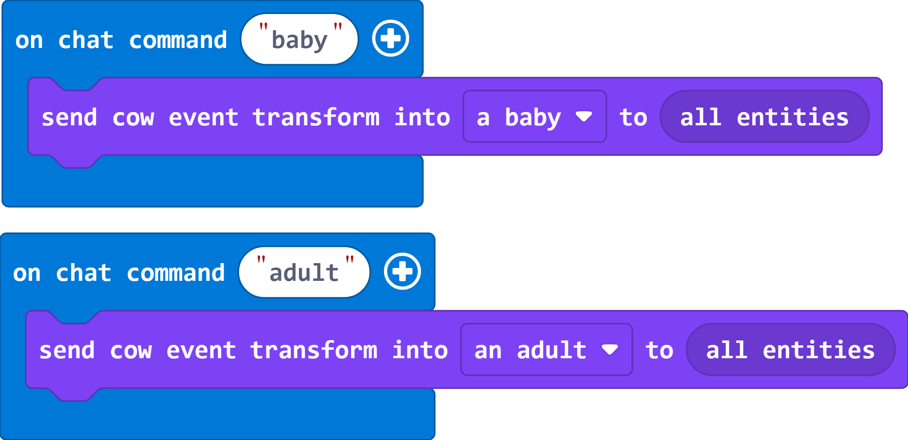
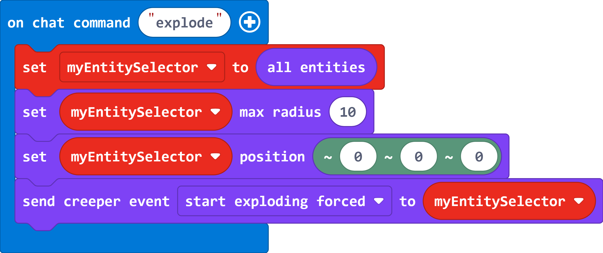

# MakeCode Mob Events extension

This is an extension for Microsoft MakeCode for Minecraft Education that allows you to send commands to mobs. These commands are based on the events available from the [event](https://learn.microsoft.com/en-us/minecraft/creator/commands/commands/event) slash command in Minecraft Bedrock Edition.

Each mob has their own set of events. For example, here are two events for cow mobs:



You can also control which mobs are affected by commands by adding rules to the selectors used to target them. Here's a program that explodes all creepers within 10 blocks of the player:



Note that these blocks are not compatible with the TargetSelector type from the Mobs category.

## Local Development

The vast majority of this extension is generated by a script. To regenerate the blocks and docs for `api.g.ts`:

```
node ./scripts/generate.js
```

To add new mob events, add them to `./scripts/spawn_events.json`.

## Contributing

This project welcomes contributions and suggestions.  Most contributions require you to agree to a
Contributor License Agreement (CLA) declaring that you have the right to, and actually do, grant us
the rights to use your contribution. For details, visit https://cla.opensource.microsoft.com.

When you submit a pull request, a CLA bot will automatically determine whether you need to provide
a CLA and decorate the PR appropriately (e.g., status check, comment). Simply follow the instructions
provided by the bot. You will only need to do this once across all repos using our CLA.

This project has adopted the [Microsoft Open Source Code of Conduct](https://opensource.microsoft.com/codeofconduct/).
For more information see the [Code of Conduct FAQ](https://opensource.microsoft.com/codeofconduct/faq/) or
contact [opencode@microsoft.com](mailto:opencode@microsoft.com) with any additional questions or comments.

## Trademarks

This project may contain trademarks or logos for projects, products, or services. Authorized use of Microsoft 
trademarks or logos is subject to and must follow 
[Microsoft's Trademark & Brand Guidelines](https://www.microsoft.com/en-us/legal/intellectualproperty/trademarks/usage/general).
Use of Microsoft trademarks or logos in modified versions of this project must not cause confusion or imply Microsoft sponsorship.
Any use of third-party trademarks or logos are subject to those third-party's policies.
